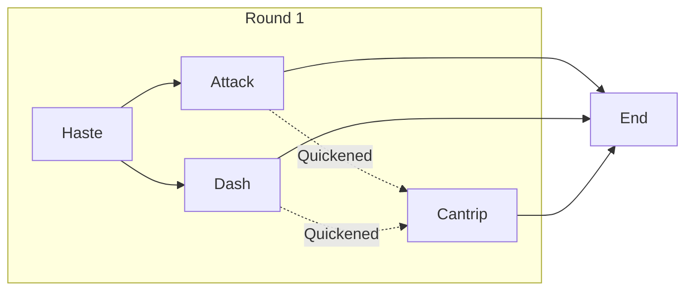
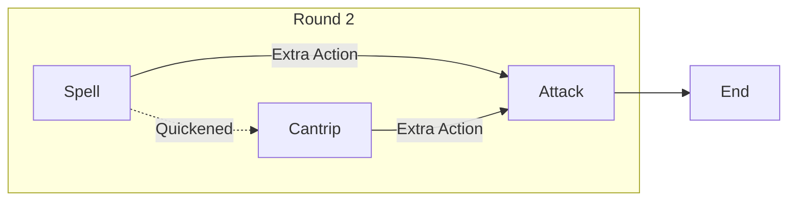

```mermaid
	flowchart LR;

		subgraph Round 1;
	    Haste --> Attack;
	    Haste --> Dash;
	    Attack -. Quickened .-> Cantrip;
	    Dash -. Quickened .-> Cantrip;
		end;
	
		Attack --> End;
		Dash --> End;
		Cantrip --> End;
	
```

```mermaid
flowchart LR;

	subgraph Round 2;
    Spell -. Quickened .-> Cantrip
	Spell -- Extra Action --> Attack 
	Cantrip -- Extra Action --> Attack 
    end;
	Attack --> End;
	
class Haste internal-link; 

```
