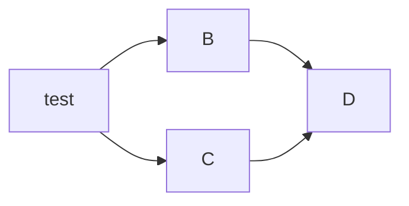
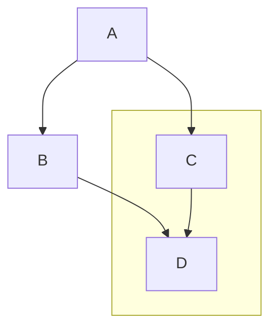
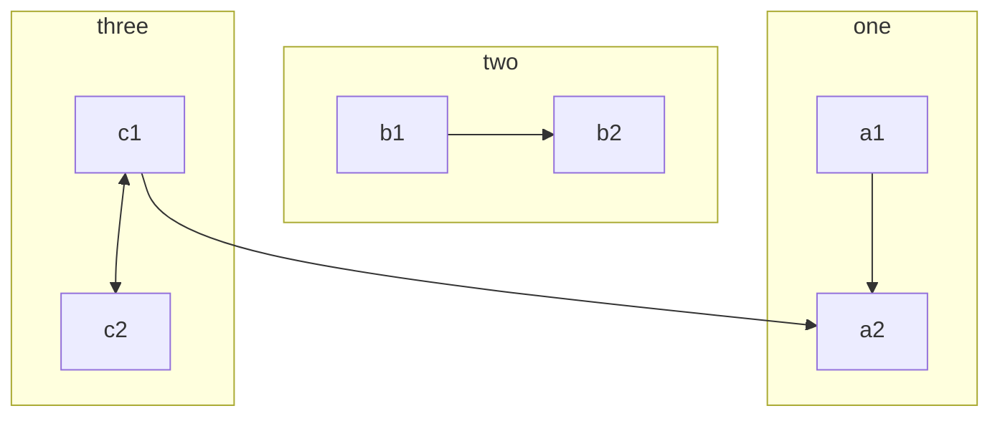

# Mermaid

```mermaid
graph LR;

	A[test]

    A-->B;  
    A-->C;  
    B-->D;  
    C-->D;
	
	
class A internal-link; 


```

```mermaid
graph TD;  
    A-->B;  
    A-->C;  
    B-->D;
    subgraph    
    C-->D;
    end
```

```mermaid
flowchart TB  
    c1-->a2  
    subgraph one  
    a1-->a2  
    end  
    subgraph two  
    b1-->b2  
    end  
    subgraph three  
    c1<-->c2  
    end
```
